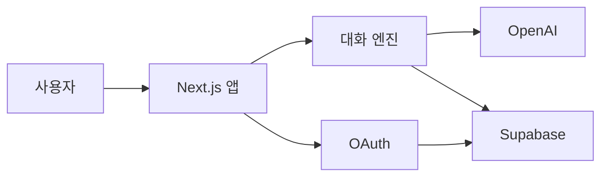

# Nook

<p align="center">
  
  <br />
  
</p>

<p align="center"><strong>복잡한 생각, 말하면서 정리해요.</strong></p>

Nook은 정리되지 않은 생각을 대화로 풀어놓으면, 사용자가 지금 고민하는 질문과
그 질문이 바뀐 흐름을 함께 정리해 주는 서비스입니다. 답을 대신 내리거나 감정을
진단하지 않고, 사용자가 직접 확인한 질문만 기록으로 남깁니다.

**Live:** [nook-nine-eta.vercel.app](https://nook-nine-eta.vercel.app/)

## 문제와 접근

사람은 고민이 복잡할수록 질문부터 정확히 적기 어렵습니다. 일반적인 AI 대화는 답변은
남기지만, 대화 중 무엇이 핵심 질문이었고 관점이 어디서 바뀌었는지는 쉽게 사라집니다.

Nook은 이를 세 단계로 다룹니다.

1. 사용자가 생각나는 대로 적으면 첫 중심 질문을 제안합니다.
2. 대화를 이어가며 질문이 실제로 바뀌었을 때만 새 질문을 제안하고, 사용자가 확정합니다.
3. 완료한 대화는 한 권의 이야기로 보관해 질문의 이동 경로와 함께 다시 볼 수 있습니다.

## 핵심 기능

- **첫 질문 정리** — 자유 입력에서 중심 질문 후보를 만들고 사용자가 수정·확정
- **질문 중심 대화** — Safety Gate와 Turn Judge를 거쳐 현재 질문에 맞는 되묻기 생성
- **질문 이동 기록** — 질문이 바뀐 지점과 근거를 노드로 남기고 과거 대화로 이동·복귀
- **생각 더미** — 진행 중 대화, 저장한 이야기, 휴지통을 분리해 관리
- **이야기 탐색** — 질문·구간 목차와 카드 넘김, 키보드·스와이프·모션 감소 지원
- **보관 수명주기** — 미완료 대화 24시간, 휴지통 7일, 탈퇴 즉시 삭제 정책
- **계정 연결** — 익명 사용자의 기록을 유지한 채 OAuth 계정으로 연결하고 닉네임 관리
- **접근성·반응형 UI** — 데스크톱 상단 탭, 모바일 하단 탭, 라이트·다크 테마

## 시스템 구조



- `src/app` — App Router 화면과 API
- `src/engine` — Safety, Judge, 질문 이동, 종료 판정
- `src/prompts` — 단계별 시스템 프롬프트
- `src/schemas` — 모델 출력과 API 계약의 Zod 검증
- `supabase/migrations` — 상태, 보관, 권한, 동시성 규칙
- `eval` — Judge·Start·Safety 회귀 fixture

모델 출력은 저장 전에 Zod로 검증하며, 질문 이동과 종료는 사용자 확인 전 확정 기록으로
취급하지 않습니다. 데이터 접근은 RLS와 서버 소유권 검사를 함께 사용합니다.

## 기술 스택

| 영역       | 기술                                            |
| ---------- | ----------------------------------------------- |
| Web        | Next.js 16, React 19, TypeScript                |
| UI         | SEED Design, CSS                                |
| Data/Auth  | Supabase Postgres, RLS, OAuth                   |
| AI         | OpenAI Responses API, structured output         |
| Validation | Zod, Node test runner, PGlite, ESLint, Prettier |
| Deploy     | Vercel, GitHub Actions                          |

## 로컬 실행

Node.js 24.x와 npm을 사용합니다.

```bash
npm ci
cp .env.example .env.local
npm run dev
```

브라우저에서 [http://localhost:3000](http://localhost:3000)을 엽니다. 첫 화면과
`/api/health`는 외부 키 없이 확인할 수 있습니다. 실제 대화·저장·로그인에는 Supabase와
OpenAI 설정이 필요합니다.

주요 환경변수 그룹은 다음과 같습니다. 전체 목록과 설명은
[`.env.example`](.env.example)을 참고하세요.

- Supabase: `NEXT_PUBLIC_SUPABASE_URL`, `NEXT_PUBLIC_SUPABASE_PUBLISHABLE_KEY`, `SUPABASE_SECRET_KEY`
- OpenAI: `OPENAI_API_KEY`, `NOOK_*_MODEL`, `NOOK_*_REASONING_EFFORT`
- 인증·배포: `NOOK_SITE_URL`, CAPTCHA 키
- 기능 플래그: `NOOK_START_API_ENABLED`, `NOOK_CONVERSATION_API_ENABLED`

실제 키는 저장소와 클라이언트 코드에 커밋하지 않습니다.

## 검증

```bash
node --experimental-strip-types --test tests/*.test.mts
npm run eval:validate
npm run eval:judge:validate
npm run validate
```

현재 기준으로 단위 테스트 **206개**, PGlite migration **28개**와 SQL suite **13개**,
Judge fixture **39개**를 관리합니다. `npm run validate`는 route type 생성, TypeScript,
ESLint, production build를 차례로 검사합니다. 세부 범위와 모델 평가 해석은
[`docs/VALIDATION.md`](docs/VALIDATION.md)에 정리했습니다.

## 배포

`main` 브랜치가 Vercel production과 연결되어 있습니다. 배포 함수는 Supabase와 같은
서울 권역에서 왕복하도록 `icn1`에 고정했습니다.

`main` push를 기준으로 GitHub Actions 검증과 Vercel production build가 각각 실행됩니다.

## 문서

| 문서                                             | 내용                              |
| ------------------------------------------------ | --------------------------------- |
| [`docs/PRD.md`](docs/PRD.md)                     | 문제 정의, 제품 원칙, 사용자 흐름 |
| [`docs/RULES.md`](docs/RULES.md)                 | AI 판정·대화·Safety·보관 규칙     |
| [`docs/ERD.md`](docs/ERD.md)                     | 데이터 모델, 상태, 삭제, RLS      |
| [`docs/EVALSET.md`](docs/EVALSET.md)             | 평가 계약과 회귀 fixture 기준     |
| [`docs/design/README.md`](docs/design/README.md) | 디자인 토큰과 UI 원칙             |
| [`docs/VALIDATION.md`](docs/VALIDATION.md)       | 테스트·모델 평가·검증 범위        |
| [`docs/STATUS.md`](docs/STATUS.md)               | 제출 시점 기능 상태와 알려진 제한 |

## 제출 시점의 알려진 제한

- Kakao 로그인은 인증 화면 진입까지 확인됐습니다. 실제 콜백·identity 생성·익명 기록
  유지까지 한 번 더 왕복 검증해야 합니다.
- 종료 설문은 데이터 구조만 있고 UI는 아직 구현하지 않았습니다.
- Google OAuth 실기기 왕복과 만료 데이터의 Cron 실행 이력은 운영에서 최종 확인이
  필요합니다.

자세한 현재 상태는 [`docs/STATUS.md`](docs/STATUS.md)를 확인하세요.
