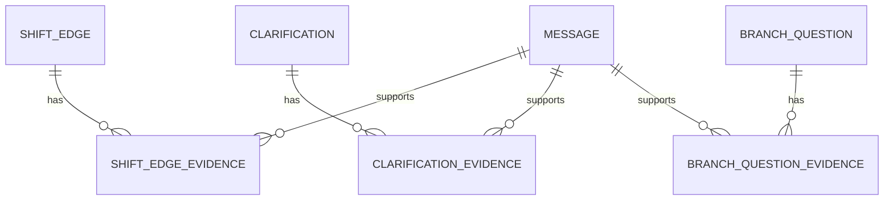
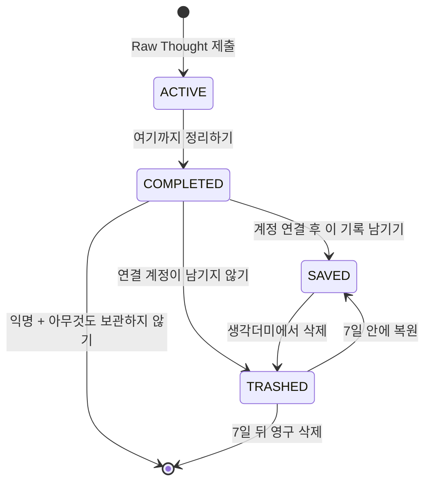
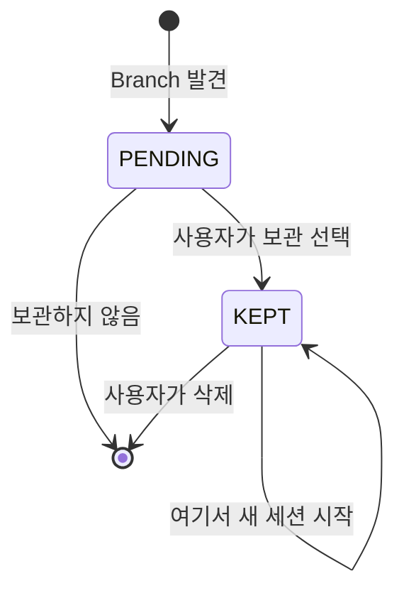

# ERD — Nook 데이터 모델 v1

> 기준일: 2026-09-12  
> 범위: Supabase PostgreSQL / Auth / RLS / 보관·삭제 정책  
> 제품 기준: `docs/PRD.md`, 실행 규칙: `docs/RULES.md`

## 1. 이번 설계에서 확정한 것

- 세션은 첫 Raw Thought를 제출한 시점에 생성한다. 화면을 연 것만으로는 만들지 않는다.
- 대화 종료 상태(`status`)와 보관 상태(`storage_state`)를 분리한다.
- 사용자가 정상 종료한 세션만 보관 여부를 선택한다.
- `생각더미`는 별도 테이블이 아니라 `COMPLETED + SAVED` 세션을 보여주는 목록이다.
- `휴지통`도 별도 테이블이 아니라 `COMPLETED + TRASHED` 세션을 보여주는 목록이다.
- 계정이 연결된 사용자의 휴지통 세션은 7일 안에 복원할 수 있고, 이후 세션 소유 데이터와 함께 영구 삭제한다.
- 익명 사용자가 아무것도 보관하지 않으면 `TRASHED`를 만들지 않고 세션을 즉시 영구 삭제한다.
- 익명 사용자가 세션이나 Branch 질문을 하나라도 보관하면 먼저 OAuth identity를 연결한다.
- 대화에서 발견된 Branch 중 사용자가 명시적으로 고른 질문만 `KEPT`로 남긴다. 나머지는 종료 결정과 함께 삭제한다.
- 보관한 질문은 한 번 사용해도 사라지지 않는다. 같은 질문에서 여러 새 세션을 시작할 수 있다.
- 보관한 질문을 삭제하면 즉시 영구 삭제한다. 이미 시작한 세션은 유지하고 `origin_branch_id`만 `NULL`이 된다.
- Question Node와 Shift Edge는 확정된 역사라 사용자 경로에서는 수정·개별 삭제하지 않는다.
- Clarification은 현재 이해라 무효화하거나 내용을 갱신할 수 있다.
- CHECK 액션, Check Event, `check_count`, Pile의 `RESUMED` 상태는 만들지 않는다.
- HANDOFF는 직접 위험으로 인한 `SAFETY_STOPPED`와 구분해 `HANDOFF_STOPPED`로 기록한다.
- HANDOFF 발화는 Message로 저장한 뒤 Judge/되묻기/Node 생성을 중단한다.
- STOP 위험 신호 발화 원문과 Moderation/Classifier 전체 입출력은 저장하지 않는다.

## 2. 코드 이름과 자연어 뜻

| 코드 이름 | 자연어 뜻 | 설명 |
|---|---|---|
| `status` | 대화 상태 | 대화가 진행 중인지, 정상 종료됐는지, Safety/HANDOFF로 멈췄는지 |
| `storage_state` | 보관 상태 | 임시인지, 생각더미에 보관됐는지, 휴지통에 있는지 |
| `TEMPORARY` | 임시 | 진행 중이거나 종료 후 사용자의 보관 결정을 기다리는 상태 |
| `SAVED` | 보관됨 | 생각더미에서 다시 볼 수 있는 상태 |
| `TRASHED` | 휴지통 | 계정이 연결된 사용자가 7일 동안 복원할 수 있는 상태 |
| `ACTIVE` | 진행 중 | 아직 사용자가 대화를 끝내지 않은 세션 |
| `COMPLETED` | 정상 종료 | 사용자가 `여기까지 정리하기`를 선택한 세션 |
| `SAFETY_STOPPED` | 안전상 중단 | 사용자 직접 위험 신호로 일반 질문 흐름을 중단한 세션 |
| `HANDOFF_STOPPED` | 도움 안내 후 종료 | Nook의 범위를 벗어나 전문·외부 도움 정보를 안내하고 끝낸 세션 |
| `PENDING` | 선택 대기 질문 | 대화 중 발견됐지만 사용자가 보관 여부를 아직 고르지 않은 Branch |
| `KEPT` | 보관한 질문 | 사용자가 나중에 다시 보고 싶다고 명시적으로 고른 질문 |
| `anchor_node_id` | 이어받은 기준 질문 | 새 구간이 이전 구간의 마지막 확정 질문을 복제하지 않고 참조하는 값 |
| `origin_branch_id` | 시작이 된 보관 질문 | 보관한 질문에서 새 세션을 시작했을 때 그 출처 |
| `purge_after` | 영구 삭제 예정 시각 | 휴지통 이동 시각에서 7일 뒤 |
| `temporary_expires_at` | 임시 데이터 정리 시각 | 진행 중 이탈 또는 보관 미결정 데이터를 정리할 기준 시각 |

## 3. 관계도

```mermaid
erDiagram
    AUTH_USER ||--o{ THOUGHT_SESSION : owns
    THOUGHT_SESSION ||--|{ SEGMENT : contains
    SEGMENT ||--o{ MESSAGE : contains
    SEGMENT ||--o{ QUESTION_NODE : owns
    QUESTION_NODE ||--o{ CLARIFICATION : describes
    QUESTION_NODE ||--o{ SHIFT_EDGE : from
    QUESTION_NODE ||--o| SHIFT_EDGE : to
    THOUGHT_SESSION ||--o{ BRANCH_QUESTION : discovers
    BRANCH_QUESTION ||--o{ THOUGHT_SESSION : starts
    THOUGHT_SESSION ||--o| SESSION_FEEDBACK : receives
    THOUGHT_SESSION ||--o{ JUDGE_LOG : produces
    THOUGHT_SESSION ||--o| SAFETY_EVENT : stops
```

증거 발화는 배열로 묻어두지 않고 연결 테이블로 참조한다.



## 4. 테이블 명세

### `auth.users` — 사용자

Supabase Auth를 사용자 원장으로 쓴다. 앱 전용 프로필 정보가 아직 없으므로 중복 `users`/`profiles` 테이블을 만들지 않는다. 익명 로그인 사용자도 고유 ID를 가지며 OAuth Identity Linking 뒤에도 같은 ID를 유지한다.

### `thought_sessions` — 생각 세션

| 컬럼 | 자연어 뜻 | 규칙 |
|---|---|---|
| `id` | 세션 ID | UUID 기본키 |
| `user_id` | 소유 사용자 | `auth.users.id`, 사용자 삭제 시 함께 삭제 |
| `origin_branch_id` | 시작이 된 보관 질문 | 선택값, 질문 삭제 시 `SET NULL` |
| `status` | 대화 상태 | `ACTIVE / COMPLETED / SAFETY_STOPPED / HANDOFF_STOPPED` |
| `storage_state` | 보관 상태 | `TEMPORARY / SAVED / TRASHED` |
| `past_probe_count` | 과거 질문 사용 횟수 | 0 또는 1 |
| `started_at` | 시작 시각 | 첫 Raw Thought 제출 시각 |
| `last_activity_at` | 마지막 안전 발화 시각 | 임시 만료 계산에 사용 |
| `completed_at` | 대화 종료 시각 | `ACTIVE`가 아니면 필수 |
| `retention_decided_at` | 보관 결정 시각 | 저장 또는 휴지통 이동을 고른 시각 |
| `trashed_at` | 휴지통 이동 시각 | `TRASHED`일 때만 존재 |
| `purge_after` | 영구 삭제 예정 시각 | `trashed_at + 7일` |
| `temporary_expires_at` | 임시 데이터 정리 시각 | 활동 시각 기준 24시간, 보관 시 `NULL` |
| `created_at` | 생성 시각 | 감사용 |
| `updated_at` | 수정 시각 | 상태 변경 시 자동 갱신 |

`raw_thought`는 이 테이블에 중복 저장하지 않는다. Safety를 통과한 첫 사용자 `Message`가 Raw Thought다. 첫 입력이 Safety STOP/HANDOFF로 분류되면 세션과 최소 안전 메타데이터만 만들고 원문 Message는 만들지 않는다.

### `segments` — 생각 흐름의 구간

| 컬럼 | 자연어 뜻 | 규칙 |
|---|---|---|
| `id` | 구간 ID | UUID 기본키 |
| `session_id` | 소속 세션 | 세션 영구 삭제 시 함께 삭제 |
| `ordinal` | 구간 순서 | 세션 안에서 1부터 증가 |
| `status` | 구간 상태 | `ACTIVE / CLOSED`, 세션당 ACTIVE 최대 1개 |
| `anchor_node_id` | 이어받은 기준 질문 | 첫 구간은 `NULL`, 이후 구간은 직전 구간 마지막 Node |
| `node_count` | 이 구간 소유 Node 수 | Anchor 제외, 최대 4 |
| `turn_count` | 안전하게 저장된 사용자 턴 수 | 최대 20 |
| `branch_count` | 이 구간에서 발견한 Branch 수 | 삭제·승격과 무관한 생성 누계, 최대 5 |
| `created_at` | 생성 시각 | 감사용 |
| `closed_at` | 구간 종료 시각 | `CLOSED`일 때 필수 |

Anchor FK는 `ON DELETE NO ACTION DEFERRABLE`을 쓴다. 개별 Anchor Node 삭제는 막되, 세션 전체를 한 트랜잭션에서 영구 삭제할 때는 내부 참조가 함께 사라질 수 있게 하기 위해서다.

### `messages` — 안전 검사를 통과한 실제 대화

| 컬럼 | 자연어 뜻 | 규칙 |
|---|---|---|
| `id` | 메시지 ID | UUID 기본키 |
| `session_id` | 소속 세션 | 구간과 같은 세션이어야 함 |
| `segment_id` | 소속 구간 | 구간 영구 삭제 시 함께 삭제 |
| `role` | 말한 주체 | `USER / ASSISTANT` |
| `kind` | 메시지 용도 | Raw Thought, 사용자 답변, Reframe 제안, Reflection 등 |
| `content` | 메시지 본문 | 빈 문자열 금지 |
| `sequence_no` | 세션 내 표시 순서 | 세션 안에서 유일 |
| `user_turn_no` | 사용자 발화 번호 | USER만 필수, Judge의 U1/U2에 대응 |
| `reply_to_message_id` | 답변 대상 메시지 | 같은 세션의 메시지만 참조 |
| `created_at` | 생성 시각 | append-only |

브라우저에서 직접 INSERT하지 않는다. Next.js 서버가 Safety Gate를 통과시킨 뒤에만 저장한다.

### `question_nodes` — 사용자가 확정한 중심 질문

| 컬럼 | 자연어 뜻 | 규칙 |
|---|---|---|
| `id` | Node ID | UUID 기본키 |
| `session_id` | 소속 세션 | 구간과 같은 세션이어야 함 |
| `segment_id` | 소속 구간 | 구간 삭제 시 함께 삭제 |
| `ordinal` | 구간 내 Node 순서 | Anchor는 포함하지 않음 |
| `kind` | Node 종류 | 첫 질문 `START`, 이동 질문 `SHIFT` |
| `ai_proposed_text` | AI 제안문 | 사용자가 보기 전에 만든 문장 |
| `final_text` | 사용자 확정문 | 그대로 승인하거나 직접 수정한 최종 질문 |
| `approved_at` | 사용자 승인 시각 | 미승인 Node row는 만들지 않음 |
| `created_at` | 생성 시각 | append-only |

### `shift_edges` — 중심 질문이 이동한 연결

| 컬럼 | 자연어 뜻 | 규칙 |
|---|---|---|
| `id` | 이동 연결 ID | UUID 기본키 |
| `session_id` | 소속 세션 | 양쪽 Node와 같은 세션 |
| `from_node_id` | 이전 중심 질문 | 삭제되면 Edge도 삭제 |
| `to_node_id` | 새 중심 질문 | `SHIFT` Node, 들어오는 Edge 최대 1개 |
| `reason_text` | 이동 이유 | 사용자에게 보여줄 한 줄 근거 |
| `created_at` | 생성 시각 | append-only |

`shift_edge_evidence`는 Edge와 근거 USER Message를 N:M으로 연결한다. `position`으로 근거 표시 순서를 보존한다.

### `clarifications` — 같은 질문 안에서 분명해진 것

| 컬럼 | 자연어 뜻 | 규칙 |
|---|---|---|
| `id` | Clarification ID | UUID 기본키 |
| `session_id` | 소속 세션 | Node와 같은 세션 |
| `node_id` | 설명 대상 질문 | Node 삭제 시 함께 삭제 |
| `text` | 현재 확인된 내용 | 관찰된 것 이상으로 확장 금지 |
| `status` | 유효 상태 | `ACTIVE / INVALIDATED` |
| `invalidated_at` | 무효화 시각 | INVALIDATED일 때 필수 |
| `created_at` | 생성 시각 | 감사용 |
| `updated_at` | 수정 시각 | 내용 갱신·무효화 시 자동 갱신 |

`clarification_evidence`는 Clarification과 근거 USER Message를 연결한다.

### `branch_questions` — 분화된 질문 / 보관한 질문

| 컬럼 | 자연어 뜻 | 규칙 |
|---|---|---|
| `id` | 질문 ID | UUID 기본키 |
| `user_id` | 소유 사용자 | 출처 세션이 사라져도 소유권을 유지하기 위해 직접 저장 |
| `source_session_id` | 발견된 세션 | 원본 영구 삭제 시 `SET NULL` |
| `source_segment_id` | 발견된 구간 | 원본 영구 삭제 시 `SET NULL` |
| `source_node_id` | 발견 당시 중심 질문 | 원본 영구 삭제 시 `SET NULL` |
| `text` | 질문 문장 | 빈 문자열 금지 |
| `retention_state` | 질문 보관 상태 | `PENDING / KEPT` |
| `kept_at` | 사용자가 보관한 시각 | KEPT일 때 필수 |
| `created_at` | 발견 시각 | 감사용 |

`PENDING`은 종료 화면 선택을 위해 잠시 저장하는 후보이고 일반 목록에는 보이지 않는다. 종료 결정 시 사용자가 고른 항목만 `KEPT`로 바꾸고 나머지는 hard delete한다. `RESUMED` 상태는 없다.

`branch_question_evidence`는 질문과 근거 USER Message를 연결한다. 원본 Message가 사라지면 연결만 사라지고, `KEPT` 질문 자체는 남는다.

### `session_feedback` — 종료 설문

| 컬럼 | 자연어 뜻 | 규칙 |
|---|---|---|
| `session_id` | 대상 세션 ID | 기본키라 세션당 최대 1개 |
| `answer` | 응답 | `CLEARER / SAME / UNSURE` |
| `created_at` | 응답 시각 | 보관 선택 전에도 제출 가능 |

세션을 영구 삭제하면 개인 응답도 함께 삭제한다. 집계가 필요해지면 개인 내용과 연결되지 않는 별도 통계로 만들며, MVP에서는 만들지 않는다.

### `judge_logs` — 검증된 Judge 운영 로그

| 컬럼 | 자연어 뜻 | 규칙 |
|---|---|---|
| `id` | 로그 ID | UUID 기본키 |
| `session_id` | 대상 세션 | 세션 삭제 시 함께 삭제 |
| `segment_id` | 대상 구간 | 구간 삭제 시 함께 삭제 |
| `user_message_id` | 판정 대상 발화 | Safety를 통과한 USER Message만 |
| `action` | Judge 판정 | `SHIFT / REFLECT / CLOSE` |
| `shift_confidence` | 이동 확신도 | `HIGH / MEDIUM / LOW` |
| `medium_reason` | MEDIUM 사유 | 해당되는 경우만 저장 |
| `validated_output` | Zod 검증 완료 결과 | 원시 모델 응답이 아니라 검증된 JSON만 |
| `model_name` | 사용 모델 | 비용·회귀 추적 |
| `prompt_version` | 프롬프트 버전 | 회귀 추적 |
| `latency_ms` | 응답 시간 | 0 이상 |
| `input_tokens` | 입력 토큰 | 선택값 |
| `output_tokens` | 출력 토큰 | 선택값 |
| `created_at` | 생성 시각 | 운영용 |

사용자는 이 테이블을 직접 읽거나 쓰지 않는다. 위험 신호 원문과 Moderation/Classifier 전체 입출력은 절대 넣지 않는다.

### `safety_events` — 최소 Safety 메타데이터

| 컬럼 | 자연어 뜻 | 규칙 |
|---|---|---|
| `id` | 이벤트 ID | UUID 기본키 |
| `session_id` | 대상 세션 | 세션당 최대 1개 |
| `label` | 분류 단계 | `AMBIGUOUS / HIGH_RISK / NONE` |
| `category` | 도움 범주 | 자살·자해, 청소년, 폭력 피해, 일반 정신건강 |
| `behavior` | 실행 동작 | 저장 이벤트는 `STOP / HANDOFF`만 |
| `trigger_source` | 감지 출처 | Moderation, Classifier, 둘 다 |
| `created_at` | 발생 시각 | 원문 없이 시각만 |

## 5. 상태 변화

### 정상 종료와 보관



위 그림의 `ACTIVE/COMPLETED`는 `status`, `SAVED/TRASHED`는 `storage_state`다. 서로 다른 축을 한 상태값으로 합치지 않는다.

### 질문 보관



## 6. 삭제 규칙

| 삭제 대상 | DB 동작 | 독립 데이터 처리 |
|---|---|---|
| 생각더미의 세션 | 즉시 삭제하지 않고 `TRASHED`, `purge_after = now() + 7 days` | 보관한 질문과 그 질문에서 시작한 다른 세션은 유지 |
| 익명 사용자의 미보관 완료 세션 | `TRASHED` 없이 즉시 hard delete | 보관 항목이 있으면 먼저 identity linking이 필요 |
| 휴지통 세션 복원 | `SAVED`로 되돌리고 삭제 시각 제거 | 생각더미에 다시 노출 |
| 만료된 휴지통 세션 | 세션과 Segment/Message/Node/Edge/Clarification/Feedback/Judge/Safety를 hard delete | 보관한 질문의 출처 FK만 `NULL` |
| 보관한 질문 | 확인 후 hard delete | 그 질문에서 시작한 세션의 `origin_branch_id`만 `NULL` |
| 개별 Question Node | 사용자 경로에서 금지 | Anchor와 Thought Path 무결성 보호 |
| 사용자 계정 | `auth.users` 삭제에 CASCADE | 사용자의 세션과 보관 질문 모두 삭제 |

휴지통 정리 함수 `purge_expired_sessions()`는 시간마다 실행한다. Supabase Cron 연결 SQL은 `supabase/snippets/schedule_retention_cleanup.sql`에 분리한다.

## 7. RLS와 쓰기 경계

- 익명 로그인 사용자도 Supabase의 `authenticated` 역할을 사용하므로 모든 개인 조회는 `auth.uid()` 소유권으로 제한한다.
- 보관 RPC는 JWT의 `is_anonymous` claim을 검사한다. 익명 사용자의 보관 요청은 거절하고, 미보관 요청은 즉시 삭제한다.
- `anon` 역할에는 Nook 개인 데이터 권한을 주지 않는다.
- 사용자는 자신의 일반 세션, 생각더미, 휴지통, 보관 질문만 읽을 수 있다.
- `SAFETY_STOPPED`와 `HANDOFF_STOPPED` 세션은 사용자 목록 조회에서 숨긴다.
- `judge_logs`와 `safety_events`는 브라우저에 노출하지 않는다.
- 메시지·Node·Edge·Judge/Safety 기록은 Next.js 서버만 쓴다. 서버는 Supabase secret key를 사용하되, 먼저 로그인 사용자와 대상 세션 소유권을 검증한다.
- 보관 결정·휴지통 이동·복원·질문 hard delete는 `SECURITY DEFINER` RPC가 `auth.uid()`를 다시 확인한다.
- 다른 사용자의 Session/Node/Branch ID를 알아도 FK 연결을 만들 수 없도록 복합 FK와 제약 트리거를 함께 쓴다.

## 8. 트랜잭션 경계

다음 변경은 반드시 한 트랜잭션이다.

1. 안전한 USER Message 저장 + `turn_count` 증가 + 임시 만료 시각 연장
2. 승인된 Question Node 저장 + `node_count` 증가
3. Branch 후보 저장 + `branch_count` 증가
4. Shift Node + Shift Edge + 근거 연결 저장
5. 세션 보관 선택 + 선택된 질문 `KEPT` 전환 + 선택하지 않은 후보 삭제 + 익명 미보관 세션 즉시 삭제
6. 구간 닫기 + Anchor를 참조하는 다음 구간 생성
7. 휴지통 영구 삭제 + 독립 데이터의 출처 FK `SET NULL`

카운터는 화면용 통계가 아니라 상한 판정의 진실값이다. 트리거가 행 삽입과 같은 트랜잭션에서 잠금·증가시키므로 동시 요청에서도 최대값을 넘기지 않는다.

## 9. 앱 조회 규칙

| 화면 | 조건 |
|---|---|
| 진행 중 세션 | `status = ACTIVE AND storage_state = TEMPORARY` |
| 생각더미 | `status = COMPLETED AND storage_state = SAVED` |
| 휴지통 | `status = COMPLETED AND storage_state = TRASHED AND purge_after > now()` |
| 남겨둔 질문 | `branch_questions.retention_state = KEPT` |

`생각더미`, `휴지통`, `진행 중 세션`은 같은 `thought_sessions`의 서로 다른 조회다. 같은 세션을 Archive/Trash 테이블에 복제하지 않는다.

## 10. 구현 파일

- `supabase/migrations/202609110001_nook_core_schema.sql` — 타입, 테이블, FK, 제약, 카운터 트리거
- `supabase/migrations/202609110002_nook_access_and_retention.sql` — RLS, 보관·복원·삭제 RPC, 안전한 조회 View
- `supabase/migrations/20260912001339_fix_temporary_expiry_nullable.sql` — SAVED/TRASHED 전환 시 임시 만료 시각을 비울 수 있도록 수정
- `supabase/migrations/20260912011744_harden_retention_rls_and_indexes.sql` — 익명 즉시 폐기, RLS 보강, FK 인덱스
- `supabase/snippets/schedule_retention_cleanup.sql` — 7일 휴지통/24시간 임시 데이터 정리 Cron 등록

## 11. 다음 구현에서 지킬 API 순서

```text
사용자 발화 수신
→ Moderation
→ Safety Classifier
→ CONTINUE면 Message 저장 + 일반 엔진 진행
→ HANDOFF면 Message 저장 + Safety Event + 도움 안내 후 종료
→ STOP이면 원문 없이 Safety Event + Safety Flow로 종료
→ Structural Check
→ Judge
→ Zod 검증 성공
→ Judge Log + Clarification/Branch 또는 Shift 제안 처리
→ 사용자 승인 뒤에만 Question Node/Shift Edge 확정
```

마이그레이션이 테이블 무결성과 접근 경계를 담당하고, 위 실행 순서는 Next.js API가 담당한다.
